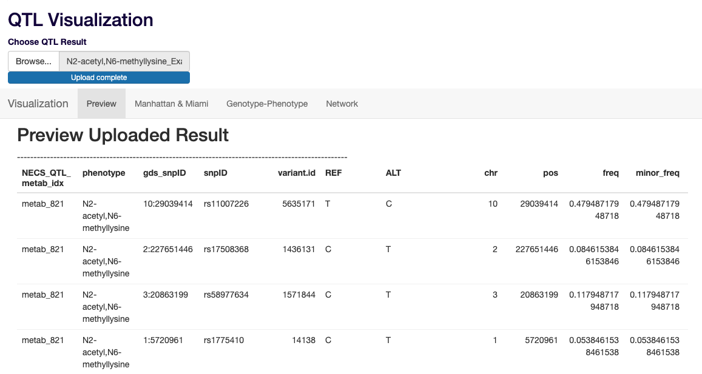
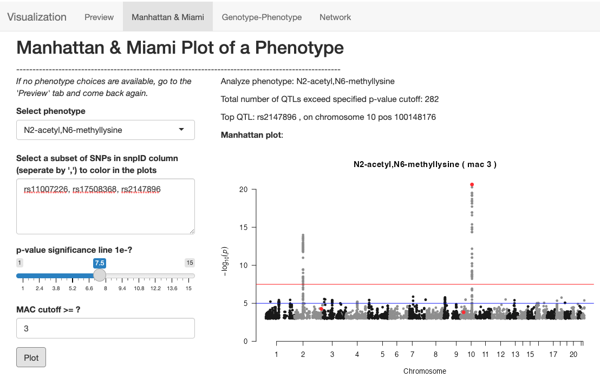
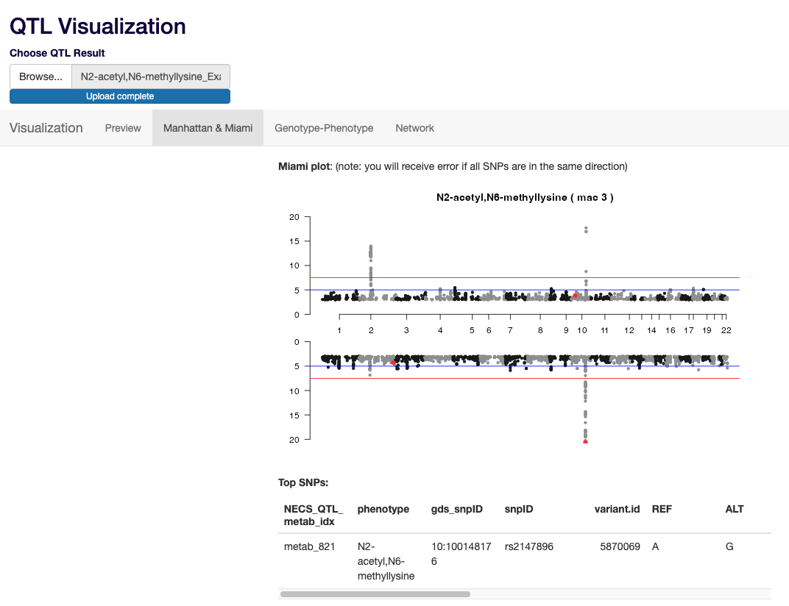
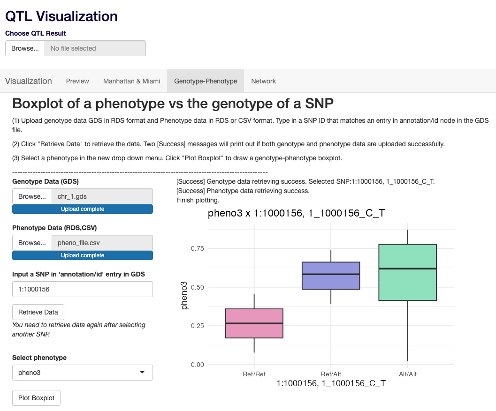

# *yQTL Pipeline* Documentations 

*A Nextflow- and R-based pipeline to organize the multiple steps of QTL discovery analysis. Built under Nextflow DSL2.*  

[](https://www.nextflow.io/) 
 
 
 
[](https://github.com/montilab/yQTL-Pipeline/issues)
[](https://zenodo.org/account/settings/github/repository/montilab/yQTLpipeline)


# Overview

We developed the _yQTL Pipeline_ – with ‘y’ indicating the dependent quantitative variable being modeled – to facilitate and automate large-scale QTL analysis. Prior to genome-wide association test, the pipeline supports the calculation or the direct input of pre-defined genome-wide principal components and genetic relationship matrix when applicable. User-specified covariates may also be supplied. Depending on the presence or absence of familial relatedness among the subjects, genome-wide association tests will be conducted using either a linear mixed-effect model or a linear model, respectively. Alternatively, the user has the option to treat the genotype as a categorical variable and conduct an ANOVA test, or assess the significance of the interaction between the SNP and a covariate. Through the adoption of the workflow management tool Nextflow, the pipeline parallelizes the analysis steps to optimize run-time and ensure reproducibility of the results. A user-friendly R Shiny App is also provided for the visualization of the results, including Manhattan plots of user-selected phenotype traits, and trait-QTL connection networks based on user-specified p-value thresholds. 
[[Preprint]](https://www.biorxiv.org/content/10.1101/2024.01.26.577518v1)

## Table of Content
- [1.Setup](https://github.com/montilab/yQTL-Pipeline#1-setup)  
- [2.Run the yQTL-Pipeline](https://github.com/montilab/yQTL-Pipeline#2-run-the-yqtl-pipeline)  
	- [Run Examples](https://github.com/montilab/yQTL-Pipeline#run-examples)  
- [3.Input Files and Parameters](https://github.com/montilab/yQTL-Pipeline#3-input-files-and-parameters)  
- [4.Input File Examples](https://github.com/montilab/yQTL-Pipeline#4-input-file-examples)  
- [5.Output Descriptions](https://github.com/montilab/yQTL-Pipeline#5-output-descriptions)  
- [6.Workflow Process Details](https://github.com/montilab/yQTL-Pipeline#6-workflow-process-details)  
- **[7.Shiny App](https://github.com/montilab/yQTL-Pipeline#7-shiny-app-usage)**  


## 1\. Setup 

### 1\.1 Install R packages
Install the required R packages:  
``` R
install.packages("dplyr")
install.packages("tidyverse")
install.packages("data.table")
install.packages("qqman")
install.packages("MatrixEQTL")
BiocManager::install("Biobase")
BiocManager::install("SNPRelate")
BiocManager::install("SeqArray")
BiocManager::install("SeqVarTools")
BiocManager::install("GENESIS")
```

### 1\.2 Decide which Nextflow (nf) scripts to use 
The pipeline is divided into three nf scripts: `Prepare.nf`, `Analysis.nf` and `Report.nf`.  
1. When genotype data is in GDS format and genetic PCs (and GRM when individual relatedness is present) are available, only `Analysis.nf` and `Report.nf` are required.  
2. When genotype data is in VCF format, and/or genetic PCs and GRM are needed, `Prepare.nf` must be run before `Analysis.nf` and `Report.nf`.  

See below in [6.Workflow Process Details](https://github.com/montilab/yQTL-Pipeline#6-workflow-process-details) for detailed description of the processes included in each of the Nextflow scripts.  

### 1\.3 Download the Nextflow executable
Nextflow requires a POSIX-compatible system (Linux, macOS, etc.) and Java 8 (Java 11 or later, up to 18) to be installed. Use the following command to download the executable. Once downloaded, optionally, you may make the Nextflow file accessible by your $PATH variable so you do not need to specify the full path to Nextflow each time.  

``` bash
$ cd /path/to/download/nextflow/
$ curl -s https://get.nextflow.io | bash
```

Sometimes, Nextflow may already be installed as a module on your machine. Use `module avail nextflow` to check. If so, you do not need to download the Nextflow executable.  

## 2\. Run the *yQTL Pipeline*  
Specify input file paths and parameters in `Config.config`. See the following [3.Input Files and Parameters](https://github.com/montilab/yQTL-Pipeline#3-input-files-and-parameters) for details.  

When running on local ($NF is the /path/to/download/nextflow/ above):  
``` bash
$ cd /path/to/yQTLpipeline/folder
$ module load R/4.1.2 
$ $NF/nextflow -c Config.config run Prepare.nf 
$ $NF/nextflow -c Config.config run Analysis.nf 
$ $NF/nextflow -c Config.config run Report.nf 
```

When running on a shared computer cluster:  
1. Set up the bash job parameters in `configs/sge.config`.  
2. Modify the 1st line of `Config.config` to use sge.config: `includeConfig 'configs/sge.config'`.  
3. Submit the code above as a bash job.  

Alternatively, when Nextflow is already installed as a module, use the following:  

``` bash
$ cd /path/to/the/yQTLpipeline
$ module load R/4.1.2 
$ module load nextflow 
$ nextflow -c Config.config run Prepare.nf 
$ nextflow -c Config.config run Analysis.nf 
$ nextflow -c Config.config run Report.nf 
```

### Run Examples  

#### Example 1  
Starting from a VCF file input, calculating PCs, and using MatrixeQTL to obtain QTL results.  

1. Navigate to the directory <example/>.  
`cd /path/to/the/yQTLpipeline/example`  
2. Launch R and run `Rscript GenerateExample_M.R.` This will write out the files `ExampleConfig_M.config` and `Example_M.sh`, as well as update the <data/> directory to set up the input file paths.  
3. Run `bash Example_M.sh`.  
4. Example results will be generated in the folder < ExampleResults_M >.  

#### Example 2  
Starting from a GDS file, pre-defined PCs, and GRM, using GENESIS to obtain QTL results.  

1. Navigate to the directory <example/>.  
`cd /path/to/the/yQTLpipeline/example`  
2. Launch R and run `Rscript GenerateExample_G.R`.  
This will write out the files `ExampleConfig_G.config` and `Example_G.sh`, as well as update the <data/> directory to set up the input file paths.  
3. Run `bash Example_G.sh`.  
4. Example results will be generated in the folder < ExampleResults_G >.  


## 3\. Input Files and Parameters 

### 3\.1 Mandatory inputs
- `params.outdir`  Directory for result storage.  
- `params.pipeline_engine`  Use "genesis" or "g" to run GENESIS when individual relatedness exists and a genetic relationship matrix (GRM) is required. Use "matrixeqtl" or "m" to run MatrixeQTL when samples are independent. Processes will start with "G_" or "M_" to indicate the selected engine.  
- `params.model_type`  Mandatory for MatrixeQTL. Specify as "linear" for additive linear model, "category" for genotype as categories with ANOVA, or "interaction" for SNP-covariate interaction specified in `params.interaction_cvrt`.  
- `params.genodat_format`  Choose "vcf" or "gds".  
- `params.vcf_list` and `params.gds_list`  Path to CSV file pointing to VCF or GDS file locations, with two columns (no header). First column: user-defined names for genotype files; Second column: full file paths. For VCF files, also set `params.gds_list = "${params.outdir}/1_data/gds_list.csv"`.  
- `params.genotype_or_dosage`  Use "genotype" or "GT" for VCF/GDS "GT" entry, or "dosage" or "DS" for "DS" entry.  
- `params.phenotype_file`  Path to phenotype data file. It should be a TXT, CSV, or RDS data frame with samples as rows and phenotypes as columns. It must include a "sample.id" column to match with genotype data. Optionally, it can include covariates.  
- `params.pheno_name` TXT file with one phenotype name per row for analysis, or "all" to analyze all non-"sample.id" columns in the phenotype file.  

### 3\.2 Optional inputs
Please ensure none of these optional parameters are left empty. Use "NA" when they're not applicable.  
- `params.covariates_file`  Covariates file, following the same format as the phenotype file, or "${params.phenotype_file}" if covariates are included there.  
- `params.covariates`  String specifying covariates to include, separated by commas without spaces. PCs must be specified, whether provided or calculated. Example: "age,gender,facility,PC1,PC2".  
- `params.covariates_factor`  String specifying categorical covariates. Example: "gender,facility".  
- `params.PC_rds`  Data frame in RDS format with samples as rows and PCs as columns. Requires a "sample.id" column matching sample IDs in genotype data. Alternatively, set `params.PC_rds = "${params.outdir}/1_data/PCs.rds"` if estimated by the pipeline.  
- `params.GRM_rds`  Genetic relationship matrix (GRM) in RDS format with sample IDs in genotype data as row and column names. Set `params.GRM_rds = "${params.outdir}/1_data/GRM.rds"` if estimated by the pipeline.  
- `params.snpset_assoc_txtfile`  TXT file with one SNP per row for analysis, matching "annotation/id" in genotype file. Alternatively, input "NA" to include all available SNPs.  
- `params.userdef_sampleid_txtfile`  TXT file with one sample ID per row for analysis. Alternatively, input "NA" to include all available samples.  

### 3\.3 Parameters to control analysis workflow
- `params.max_forks_parallel`  Numeric value controlling the max number of parallel processes in QTL discovery.  
- `params.max_pheno_parallel`  Numeric value controlling the maximum number of phenotypes per QTL discovery process in MatrixeQTL. Increasing it reduces computation time but increases memory usage in the M_QTL_analysis process.  
- `params.pval_cutoff`  Numeric value setting the threshold for saving and reporting QTL results.  
- `params.output_result_csv`  Boolean, "true" or "false" (lowercase *with* quotes). QTL results are saved in RDS format by default. Set to "true" to also output results in CSV format.  

**PCA Parameters**  
- `params.start_PC`  Boolean, true or false (lowercase, *without* quotes). Set to true to estimate genetic PCs and GRM using the pipeline.  
When `params.start_PC = true`, set up the following:  
- `params.snpset_PCA_txtfile`  Optionally specify a TXT file containing SNP IDs for genetic PC estimation. SNP IDs match the genotype file's annotation entry. Alternatively, input "NA" to prune SNPs using LD.  
- `params.pcair_kinthresh`  Numeric value setting threshold for pairwise kinship coefficients in kinobj, declaring relatedness. Commonly used value is 11, corresponding to 4th degree relatives. See PC-Air documentation for details. See [PC-Air documentation](https://rdrr.io/bioc/GENESIS/man/pcair.html) for more details.  
- `params.pcair_divthresh`  Numeric value setting threshold for pairwise ancestry divergence measures in divobj, declaring ancestral divergence. Commonly used value is 11, corresponding to -2^(-11/2) ~ -0.022. See [PC-Air documentation](https://rdrr.io/bioc/GENESIS/man/pcair.html) for more details.  

**Plotting Parameters**  
These parameters solely control plot generation and do not filter QTL results in RDS or CSV.  
- `params.draw_genopheno_boxplot`  Set to "true" to generate genotype-phenotype boxplots for the most significant variant in each genotype file, if it passes the specified p-value threshold.  
- `params.boxplot_p_cutoff`  P-value threshold for determining significance of the top SNP.  
- `params.plot_mac`  Numeric value determining the minimum minor allele count (MAC) for inclusion of a SNP in QQ plot, Manhattan plot, and Miami plot, to avoid artefacts from too few observations. Common values for rare SNPs include 3 or 5, while 20 for common SNPs.  
- `params.plot_resolution`  Numeric value setting the resolution (dpi) for saving the plots. Common values include 72, 100, and 120.  
- `params.plot_size`  Numeric value controlling the size of the plots in pixels. Common values include 400 and 600.  

**PreQC**
We offer a supporting script, PreQC.nf, for quality filtering of input VCF files.  
- `params.hwe_p`  Hardy-Weinberg Equilibrium p-value. Variants with a p-value below this threshold will be considered to violate HWE and will be removed. Input 1 to avoid filtering out any variants.  
- `params.min_mac`  Numeric value. Only variants with a minor allele count equal to or higher than this threshold will be retained.  
- `params.max_missing_allowed`  Numeric value ranging from 0 to 1. It sets the maximum acceptable missing rate. For instance, inputting 0.1 will remove variants with a missingness rate exceeding 10%.  


## 4\. Input File Examples 
*Note: All TXT and CSV files must end with a complete final line. This means you should see an empty line at the end of the file when opened in a text editor.*  

CSV file to specify genotype file paths (without header):  
|        |                                   |
|:-------|:----------------------------------|
| chr\_1 | /yQTL-Pipeline/data/gds/chr_1.gds |
| chr\_2 | /yQTL-Pipeline/data/gds/chr_2.gds |
| chr\_3 | /yQTL-Pipeline/data/gds/chr_3.gds |


Phenotype data frame with covariates:  

| sample.id | age | sex | gene1 | gene2 |
|:----------|:----|:----|------:|------:|
| HG00110   | 40  | F   | 7.001 | 6.540 |
| HG00116   | 50  | M   | 7.025 | 6.440 |
| HG00120   | 65  | F   | 8.035 | 6.420 |
| HG00128   | 35  | F   | 7.015 | 6.154 |


GRM:  

|         |    HG00110 |    HG00116 |    HG00120 |    HG00128 |
|:--------|-----------:|-----------:|-----------:|-----------:|
| HG00110 |  1.0332116 | -0.0179534 |  0.0070812 | -0.0114037 |
| HG00116 | -0.0179534 |  0.9901158 |  0.1161200 | -0.0369330 |
| HG00120 |  0.0070812 |  0.1161200 |  0.9772376 | -0.0595185 |
| HG00128 | -0.0114037 | -0.0369330 | -0.0595185 |  0.9500809 |


## 5\. Output Descriptions 
The results will be saved in the directory specified in `params.outdir`, with the following subdirectories.

### 5\.1 Preparations and intermediate results  
- < 1_data >. Includes covariates and sample IDs used. If the input genotype data was in VCF format, the converted GDS files will also be saved here.  
- < 1_phenotype_data >. Includes the phenotype data after splitting the original input into multiple chunks (when params.pipeline_engine = "matrixeqtl") or single phenotype (when params.pipeline_engine = "genesis").  
- < 2_SNP_info >. Contains information about each SNP obtained from the GDS file.  
- < 3_individual_results >. Contains QTL association results of each genotype data with each phenotype chunk (when params.pipeline_engine = "matrixeqtl") or each phenotype (when params.pipeline_engine = "genesis"), without SNP information.  
- < 4_individual_results_SNPinfo >. Combines < 3_individual_results > with the corresponding SNP information in < 2_SNP_info >.  

### 5\.2 Results and reports  
- **< 5_Results_Summary >**. Contains the QTL results for each phenotype in RDS format, along with a count table of the number of identified QTLs. Additionally, includes phenotype expression histograms, QQ plots, Manhattan plots, and Miami plots for each phenotype. If QTL results are too large to merge into a single file, you can obtain and merge them in <4_individual_results_SNPinfo>.  

### 5\.3 Logs  
All logs for each of the analysis steps will be saved in each of the subfolders.  

### 5\.4 Cleaning to save space  
*proceed with caution*: Nextflow saves all intermediate results in the `work/` directory. Once the pipeline successfully finishes, it's recommended to discard the `work/` directory.  
*proceed with caution*: QTL results can be very large. Once the user confirms that all SNP and phenotype associations are saved in <5_Results_Summary>, the results in <2_SNP_info>, <3_individual_results>, and <4_individual_results_SNPinfo> can be discarded since <5_Results_Summary> is the merged version of them. However, it's highly recommended to save a copy of the null models for each phenotype (`3_individual_results/nullmod_[phenotype]_[gds].rds`).  

## 6\. Workflow Process Details
The processes included in each of the Nextflow scripts are:  

**Prepare.nf**  
1. `vcf_to_gds`  Converts VCF files to GDS format.  
2. `write_gds_list`  Writes the resulting GDS file paths into a CSV file for Analysis.nf to use.  
3. `merge_gds`  Merges the GDS files for the following process.  
4. `PCA` or `PCA_GRM`  Performs genetic PCA analysis using PC-AiR and obtains GRM using PC-Relate, utilizing the GDS generated from `merge_gds`.  

**Analysis.nf**  
1. `get_shared_sampleid`  Obtains shared sample IDs from input genotype files, phenotype file, and optional input files such as covariate file, PC RDS file, and user-defined sample ID TXT file. These sample IDs are used in the analysis.  
2. `split_pheno`  Splits phenotype data into chunks or single phenotypes for parallel analysis.  
3. `prepare_cvrt`  Reads and processes covariate file, handling categorical covariates.  
4. `SNP_info`  Retrieves SNP information from the GDS file.  
	When using GENESIS, this includes variant ID, REF (reference allele), ALT.ca (alternative allele, coded allele), and snpID (annotation in genotype file).  
	When using MatrixeQTL, additional entries such as chr (chromosome), pos (position), freq.ca (frequency of coded allele), freq.minor (frequency of minor allele), miss (missing rate), n.obs (number of observances), and MAC (minor allele count) are included. These columns are automatically returned by GENESIS.  
5. `QTL_analysis`  Performs association tests of SNPs from each genotype data file with each phenotype.  
6. `merge_info_QTL`  Combines QTL results obtained from QTL_analysis with corresponding SNP information from the SNP_info process.  
7. `QTL_count_wrap`  Counts the number of QTLs returned by the QTL_analysis process.  

**Report.nf**  
1. `QTL_results_wrap`  For each phenotype, merge the QTL results from QTL_count_wrap in Analysis.nf and create phenotype histogram plot, QQ plot, Manhattan plot, and Miami plot.  

## 7\. Shiny App Usage
We've developed an R Shiny App available in the App folder to facilitate downstream visualization. Simply open app.R using RStudio and click the `Run App` button at the top right.  

### 7\.1 Upload QTL analysis result as an RDS file 
  
The uploaded QTL result is a data frame that includes the following columns:  
- chr  
- pos  
- snpID  
- phenotype  
- pvalue / Score.pval  
- beta / beta.ca / Est / Est.ca
- mac / MAC  

An example is provided as `N2-acetyl,N6-methyllysine_Example.rds`.  

### 7\.2 Manhattan and Miami plots 
Select a phenotype from the dropdown menu, specify the significance p-value threshold, and optionally provide a list of SNPs to highlight in the plots.  
  
  

### 7\.3 Genotype-Phenotype boxplot 
First, upload a GDS file and a phenotype file in RDS or CSV format. Specify a variant from the "annotation/id" entry in the GDS file. Click "Retrieve Data". If successful, a new dropdown menu and plotting button will appear.  
For example, you can use 'data/gds/chr_1.gds' for the GDS file and 'data/pheno_file.csv' for the phenotype file. Select variant '1:1000156'.  
Second, select a phenotype from the new dropdown menu and click "Plot Boxplot".  
  

### 7\.4 Network of variants and phenotypes 
QTL results consist of multiple phenotypes and variants. Therefore, we offer an option to visualize the associations as a network. For example, upload `Network_Example.rds` to the "Choose QTL result" file input at the top.  
Next, select a p-value threshold and MAC (minor allele count) threshold, and plot the network.  
Since genetic variants are often in high linkage disequilibrium (LD) with each other, only the top variant in each chromosome will be included.  

  

-end-
